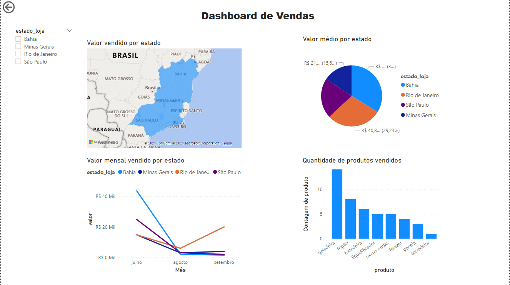

# Apresentação de Dados com Power BI
### Minicurso apresentado durante o evento IF++ do Instituto Federal de Educação do Sul de Minas Gerais.

## Tecnologias Utilizadas
- [Power BI](https://powerbi.microsoft.com/pt-br/desktop/)

## IF++

### O <a href="https://ifmaismais.netlify.app/"> IF++ </a> é um encontro relacionado a tecnologia organizado diretamente por professores e alunos do IFSULDEMINAS, no qual reúnem minicursos e palestras para compartilhar conhecimentos e experiências. O minicurso em questão faz referência à uma introdução a ferramenta Power BI e foi apresentado no dia 20 de outubro de 2021.

## Instalação do Power BI Desktop

### A versão Desktop é gratuíta e pode ser baixada clicando <a href='https://powerbi.microsoft.com/pt-br/desktop/'>aqui</a>.

## Datasets

### Foram disponibilizados alguns arquivos de extensão .csv para serem trabalhados durante o minicurso. Esses estão localizados na seguinte pasta:
~~~
./datasets
~~~

## Exemplo dashboard

## Autores

<b>Otávio Silva</b> 

